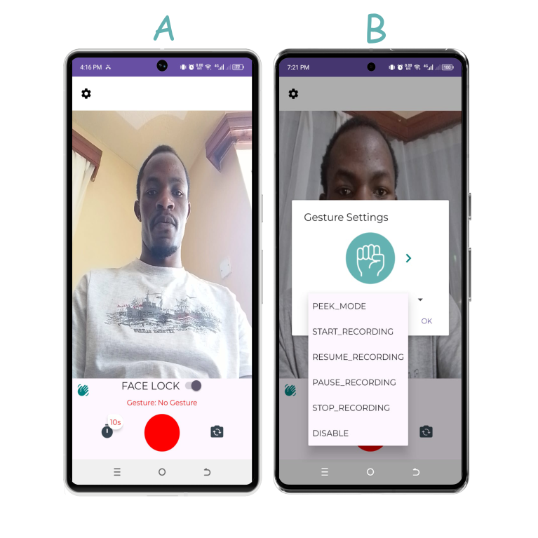
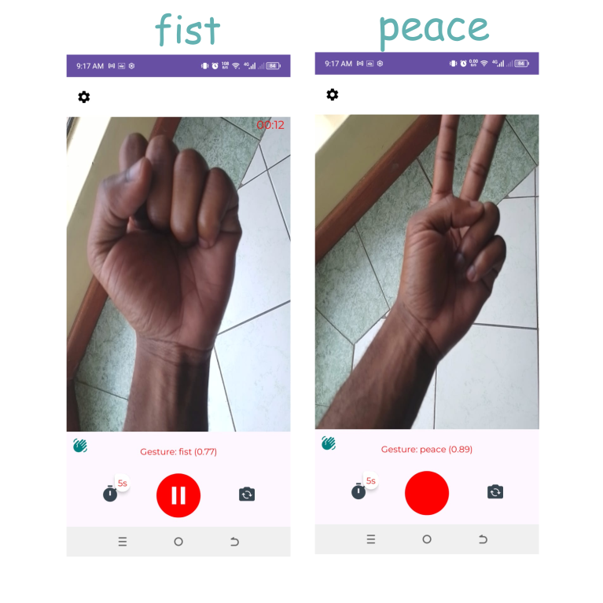

# Ishara Video Recorder
## Problem Statement
Most people use their mobile phone to shoot videos, but their level of control is limited when done over a distance, say while the device is appended on a tripod.
Allowing the user to have multiple takes and get to comfortably control functionalities over a distance, can help save on time and storage, and make them focus more on their content and less on things like system camera disconnecting and too much video whitespaces.

Ishara only requires the initial setup, and the rest will be handled by the gestures as set up by the user.

Additionally, the use of Audio feedback makes it possible to follow up on what happens when the user uses the back camera which mostly have a higher quality.

Have a look at some of the functionalities you can control with gestures in figure B, and view the interface on A:
See the screenshots attached:

Some sample detections are as shown below:

